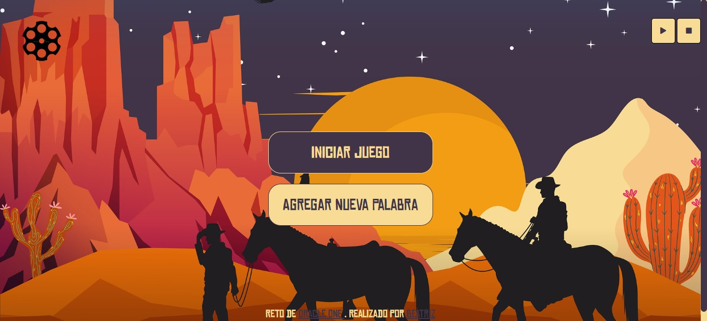

# Oracle Next Education | Desafío N° 1 | Ahorcadito - Versión Wild West

Este desafío fue realizado como práctica para Oracle Next Education.

### El Desafío

 **Requisitos**
- Debe funcionar solo con letras mayúsculas;
- No deben ser utilizadas letras con acentos ni caracteres especiales;
- Al completar o dibujo de la horca, debe ser mostrado un mensaje "Fin del juego" en la pantalla;
- Si se completa la palabra correcta antes de que se acaben los intentos, debe ser mostrado un mensaje de "Ganaste, Felicidades!" en la pantalla.
- La página debe tener los guiones indicando cada letra da palabra, separados por un espacio;
- Para comenzar el juego la página debe tener un botón de "Iniciar Juego";
- No debe ser posible escribir números dentro del juego.
- Las letras equivocadas deben aparecer en la pantalla, pero no pueden aparecer de forma repetida;
- Las letras correctas deben aparecer en la pantalla encima de los guiones, en la posición correcta em relación a la palabra.

Extras:
- La página debe tener un campo para inserción de texto con la finalidad de adicionar nuevas palabras al juego, e un botón "Agregar palabra".

### Muestra de funcionamiento

https://www.youtube.com/watch?v=VQHOUQey8Ho

### Links

- Página URL: https://beatrizang.github.io/juego-del-ahorcadoWW/

### Construido con

- HTML5
- CSS3
- Flexbox
- Javascript
# Ahorcado_Wester
